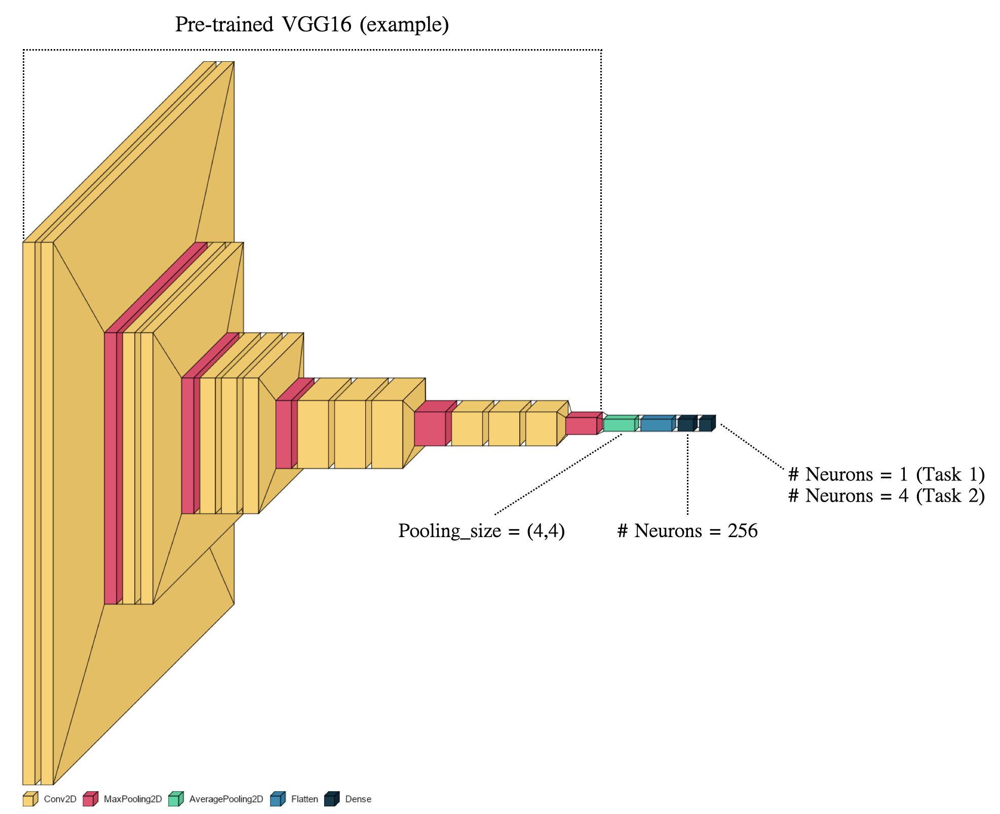
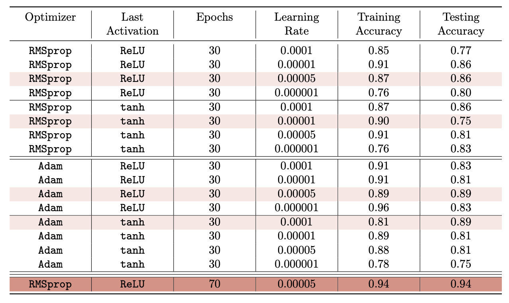

# Chest X-ray Classification

## Table of Contents
1. [Overview](#overview)
2. [Data](#data)
3. [Model](#model)
4. [Training](#training)
5. [Results](#results)

## Overview
As we navigate through the unprecedented challenges posed by the COVID-19 pandemic, the importance of effective diagnostic tools cannot be overstated. Chest X-ray imaging has emerged as a crucial component in the identification and management of various lung diseases, including COVID-19 and other forms of pneumonia.

This project, therefore, aims to leverage the power of deep learning to build an automated system capable of classifying chest X-ray images into categories based on the disease present: COVID-19, various types of pneumonia (Bac Pneumonia and Vir Pneumonia), or no disease (Normal). By doing this, we hope to create a tool that could aid in the diagnosis of these diseases, especially in resource-constrained settings where access to trained radiologists might be limited.


The goal is not to replace healthcare professionals but to provide them with an additional tool that can increase their efficiency and effectiveness. Furthermore, given the speed at which machine learning models can analyze X-ray images, this tool could significantly reduce the time between imaging and diagnosis, thereby enabling faster initiation of treatment.

Moreover, by incorporating multiple pneumonia types in our classification task, we aim to offer a more comprehensive diagnostic aid. Many lung diseases manifest similar symptoms but require different treatment protocols; hence, distinguishing between them is crucial.

As a secondary objective, we hope that this project can serve as a useful resource for others in the AI and healthcare community, showcasing the potential of AI in medical imaging and fostering further innovation in this space.

## Data
The primary dataset used in this project was generously provided by Prof. Sarah Bargal at Boston University and can be accessed [here](https://drive.google.com/file/d/1Y88tgqpQ1Pjko_7rntcPowOJs_QNOrJ-/view). This dataset comprises chest X-ray images labeled into various classes: COVID-19, different types of pneumonia, and Normal (no disease).

For those interested in additional data for training or validation, you might consider utilizing data from Kaggle's extensive resources. One such dataset, which includes chest X-ray images of patients with pneumonia, is available [here](https://www.kaggle.com/datasets/paultimothymooney/chest-xray-pneumonia).


As part of the data preprocessing, images were resized to fit the input requirements of the deep learning models. Image augmentation techniques were also employed to increase the robustness of the models and to prevent overfitting.

## Model
This project leverages the power of deep learning by employing a variety of pre-trained models, making it an exploration into transfer learning as well. All models utilized have been pre-trained on the ImageNet dataset, ensuring robust initial feature extraction capabilities. Each model is used without their top layers (the fully connected layers), as the task-specific layers are added according to our specific requirements in this project, which is a multi-classification task.

Model Visualization (example): 


The models utilized are as follows:

- **VGG-16**: Developed by Oxford's renowned Visual Geometry Group (VGG), VGG-16 is a robust model known for its simplicity and high performance on the ImageNet dataset.

- **VGG-19**: An expansion of VGG-16, VGG-19 offers deeper layers for more complex feature extraction, potentially leading to improved results.

- **Xception**: A model that implements depthwise separable convolutions, Xception offers improved performance with reduced computational load when compared to models of similar size.

- **InceptionV3**: Known for its unique 'inception' modules that allow for more efficient learning of spatial hierarchies, InceptionV3 is an innovative approach to image classification.

- **DenseNet201**: DenseNet (Densely Connected Convolutional Networks) extends the idea of residual connections to connect each layer to every other layer in a feed-forward fashion to ensure maximum information flow between layers in the network.

- **NASNetMobile**: A model discovered using Neural Architecture Search (NAS), NASNetMobile provides a balance of model complexity and computational demand, making it suitable for mobile applications.

- **ResNet152**: A deeper version of the ResNet architecture (Residual Networks), ResNet152 allows for training of very deep networks by utilizing skip connections or shortcuts to jump over some layers.

- **ResNet50**: A smaller version of ResNet152, this model retains the power of deep residual learning while being more computationally efficient.

Each model's performance in the classification task is evaluated and compared, with the results being discussed in the 'Results' section.


## Training
The training process involved a number of critical decisions and steps. For all models, we used an 80-20 training-validation split to ensure a fair evaluation of the model's performance. The Adam optimizer was chosen for its efficiency and strong performance in handling sparse gradients on noisy problems. We utilized categorical cross-entropy as the loss function given our multi-class classification task.

In terms of hyperparameters, we set an initial learning rate of 0.0001, with a decay schedule applied to reduce the learning rate as the training progressed. The batch size was set to 16, and models were trained for up to 200 epochs. To counteract overfitting, we implemented dropout layers with dropout rate 0.25 in the model architecture.

Furthermore, data augmentation techniques, including rotations, width shift, height shift, and horizontal flips, were used to enhance the generalization of the models. This helped increase the diversity of our data without needing to actually collect more data, by creating 'new' augmented data.

- Data Augmentataion:
```python 
train_datagen = ImageDataGenerator(rescale=1./255,
                                    rotation_range=20,
                                    featurewise_center = True,
                                    featurewise_std_normalization = True,
                                    width_shift_range=0.1,
                                    height_shift_range=0.1,
                                    shear_range=0.25,
                                    zoom_range=0.1,
                                    zca_whitening = True,
                                    channel_shift_range = 50,
                                    horizontal_flip = False,
                                    vertical_flip = False,
                                    validation_split = 0.2,
                                    fill_mode='constant')
```

- Training Accuracy and Loss Plot: 


## Results
After the rigorous training and evaluation process, we observed interesting results which are detailed in this section.

### Model Comparison
We tried several deep learning architectures, each with its own strengths and trade-offs. The comparative performance of different models is summarized in the table below.



### Confusion Matrix
The confusion matrix gives us an insight into the types of errors made by the model. For each model, the confusion matrix on the validation data is shown below:


These matrices highlight the model's performance on each class and where the model is making the most mistakes.

### t-SNE Visualization
To better understand the high-dimensional space learned by our models, we utilized t-SNE, a dimensionality reduction technique particularly well suited for the visualization of high-dimensional datasets. The 2D t-SNE plots for the models are as follows:


These visualizations help us understand the decision boundaries of our models and how well they separate different classes in the learned feature space.

### Explainability
We performed a heatmap visualization on the output layer of our models, focusing particularly on the representations of the four classes: `covid`, `normal`, `viral pneumonia`, and `bacterial pneumonia`. The heatmap gives us an understanding of the areas in the image that the model deems important for making the prediction.


A striking observation from the heatmap is the stark contrast between the `covid` and `normal` classes, indicating that the model is well able to distinguish between these two classes. However, the `viral pneumonia` and `bacterial pneumonia` classes exhibit strong similarity in their heat signatures. This could potentially be one of the reasons why the model struggles to accurately differentiate between `viral pneumonia` and `bacterial pneumonia`.

These insights provide us valuable direction for further investigation. For instance, this suggests we may need to adopt techniques that can better capture the subtle differences between `viral pneumonia` and `bacterial pneumonia` in future iterations of the model.